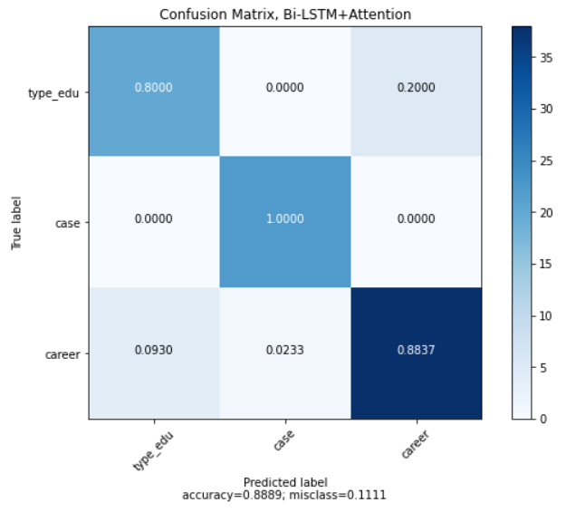

# The implementation of Vietnamese Text Classification

We aims to build a simple attention based deep neural model to classify the vietnamese texts.

## Table of contents
- Requirements
- Dataset
- Training
- Results

## Requirements
```bash
pip install -r requirements.txt
```

## Dataset
We collected over 400 questions that relates to the university consultancy in Vietnam. After considering the features, we assign them into 3 classes.

## Training
Step by step for training, please refer the notebook [test_test.ipynb](./code/train_test.ipynb)

## Results
We achieve the exciting performance that results in 89\% accuracy in the validation set.



